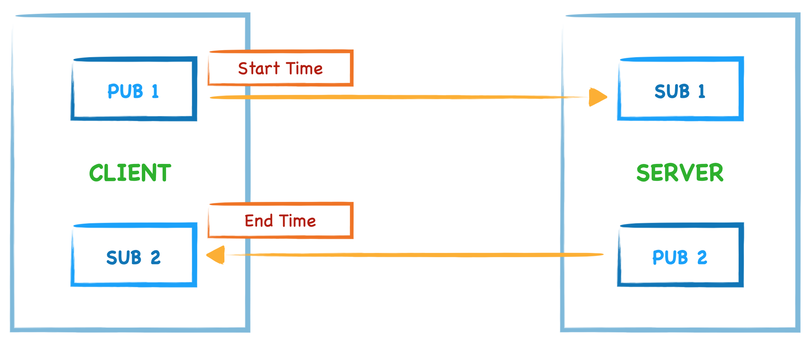
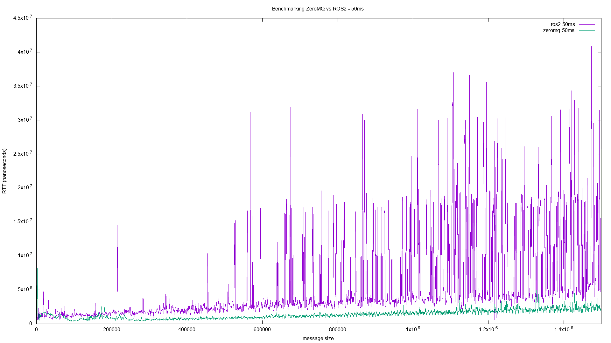
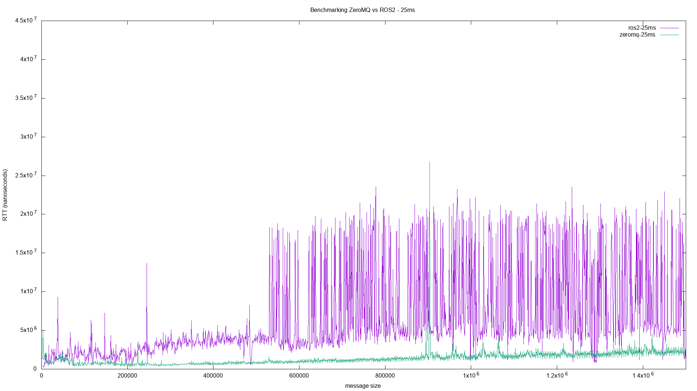
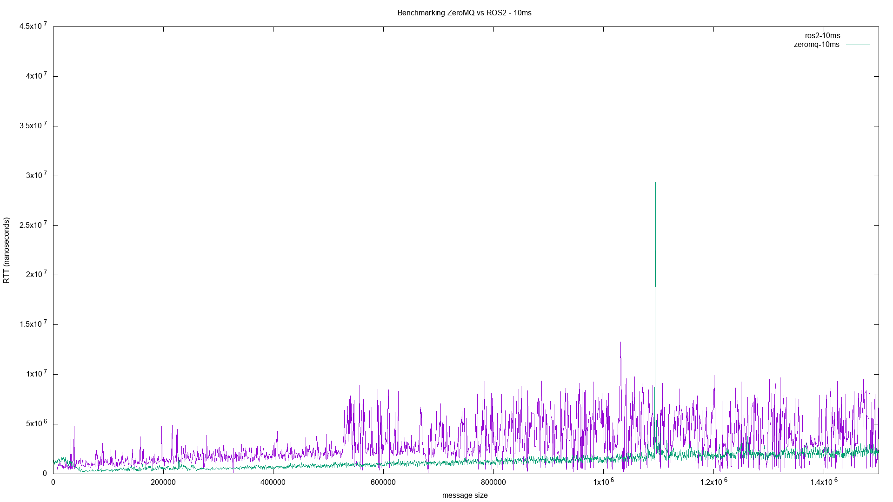

Benchmarking ZeroMQ vs ROS2
=========

Questo repository tratta la valutazione di [ZeroMQ](https://zeromq.org/) 
come libreria di messaggistica rispetto a [ROS2](https://www.ros.org).  

Il progetto è stato realizzato per il corso di Real Time Embedded System dell'Università di Modena e Reggio Emilia con l'obiettivo di confrontare le due librerie e stabilire quale soluzione sia quella con minor latenza durante l'invio/ricezione di messaggi.

## ZeroMQ
ZeroMQ è una libreria di messaggistica asincrona ad alte prestazioni, leggera e semplice da usare. Offre numerosi pattern di messaggistica e ha come punto di forza la possibilità di essere eseguita senza un broker di messaggi dedicato.

Permette alle applicazioni di comunicare tra loro tramite diverse modalità di trasporto: TCP, multicast, in-process, inter-process. Non è necessario cambiare il codice per utilizzare un modalità di trasporto diverso.
Gestisce i lettori lenti/bloccati in modo sicuro, utilizzando diverse strategie che dipendono dal modello di messaggistica.

Nell'universo ZeroMQ, le socket gestiscono automaticamente un'intera serie di connessioni in modo trasparente all'utente. Non esiste un metodo zmq_accept(). Quando una socket è associata a un endpoint, inizia automaticamente ad accettare le connessioni, riconnettendosi automaticamente nel caso in cui queste vengano interrotte. 
Questa è la chiave per la scalabilità di ZeroMQ.

### Comunicazione scelta per i test
Avendo a disposizione numero tipologie di trasporto, per i test effettuati, si è scelto di utilizzare TCP, il quale essendo di tipo disconesso non richiede che l'endpoint esista prima di connettersi ad esso. In particolare i client e i server possono connettersi e associarsi in qualsiasi momento, possono andare e tornare rimanendo trasparenti per le applicazioni.

## ROS2
Il Robot Operating System (ROS) è un insieme di tools e librerie open source che permettono di creare applicazioni anche molto complesse in ambito robotico. 
ROS consente di mettere in comunicazioni una rete di nodi (processi) con un hub centrale in modo semplice e tramite diversi livelli di affidabilità. Vengono fornite funzionalità per astrarre l’hardware, i driver dei dispositivi, la comunicazione tra processi su più macchine, gli strumenti per il test, la visualizzazione e molto altro ancora.

In ROS2, rispetto a ROS1, sono stati sostituiti i classici protocolli di trasporto TCP/UDP in favore del protocollo DDS (Data Distribution Service) il quale permette di avere un elevato livello di configurazione. Per esempio, è possibile configurare le impostazioni QoS per ogni livello dello stack di comunicazione. ROS2 cerca quindi di nascondere la complessità di DDS, esponendo però un'astrazione che permette l'utilizzo di alcune delle sue funzionalità più importanti.

## Pattern: Publisher - Subscriber (PUB-SUB)
ZeroMq mette a disposizione numerosi pattern di comunicazione ma in quanto ROS2 preferisce l'utilizzo del pattern Publisher-Subscriber, si è deciso di utilizzare quest'utltimo per l'esecuzione dell'esperimento.

Nel pattern PUB-SUB i nodi si scambiano direttamente dei messaggi.
Il nodo che fa da publisher, non conosce l'identità dei destinatari, si limita a pubblicare il suo messaggio all'interno di un determinato topic al quale si iscriveranno tutti i nodi subscriber che vorranno ricevere quelle informazioni. 
E' possibile quindi che ci siano più nodi che pubblicano i messaggi sempre con il vincolo che solo loro potranno inviare messaggi ai vari topic: si ha una comunicazione N-to-N unidirezionale.

## Benchmarking ZeroMQ vs ROS2

Per confrontare le due librerie e stabilire quale soluzione sia quella con minor latenza durante l'invio/ricezione di messaggi si è scelto di implementare il design pattern precedentemente presentato: Publisher-Subscriber.

Per entrambe le librerie sono stati creati 2 nodi (client e server) e sono stati messi in comunicazione.

In entrambi i casi viene eseguito il seguente ciclo per 1500 volte:
1. Il client **invia** un messaggio al server aumentandone la dimensione di 1 KByte ad ogni iterazione
2. Il client segna il **tempo di invio** del messaggio
3. Il server, ricevuto il messaggio, invia una **risposta** al client
4. Il client, ricevuta la risposta, segna il **tempo di ricezione**
5. Il client infine calcola la differenza dei due tempi e la salva sul file *time.txt*

Il tempo salvato sarà quindi il ***Round Trip Time*** (RTT), ovvero il tempo impiegato tra l'invio di una richiesta e la ricezione della risposta.

## Risultati
I risultati sono stati ottenuti ripetendo il test inviando i messaggi ogni 10ms, 25ms e 50ms.

- Invio dei messaggi ogni 50ms

- Invio dei messaggi ogni 25ms

- Invio dei messaggi ogni 10ms

## Conclusioni

Dai benchmark effettuati è possibile evincere che:
- Tendenzialmente ZeroMq risulta avere un RTT quasi minore di ROS2 con l'aumento della dimensione del messaggio inviato.
- Nella fase iniziale della comunicazione ROS2 sembra avere prestazioni migliori di ZeroMQ, il quale dopo aver instaurato correttamente la connessione, diventa più veloce.
- ROS2 risulta essere penalizzato probabilemnte a causa dell'overhead applicato sui nodi, essendo esso un framework a differenza di ZeroMQ il quale è una libreria.

## Replica dell'esperimento
L'esperimento è stato costrutito per essere eseguito in un ambiente containerizzato attraverso l'utilizzo di Docker.
- Versione di Docker utilizzata: **26.0.0**
- Distribuzione di ROS2 utilizzata: **Foxy**
- Versione di ZeroMQ utilizzata: pyzmq **26.0.3**

All'interno della seguente [guida](start_project.md) è possibile trovare tutti i comandi necessari per replicare l'esperimento.

Per la realizzazione dei grafici è stato usato Gnuplot. Un programma gratuito e interattivo per la creazione di grafici 2D.