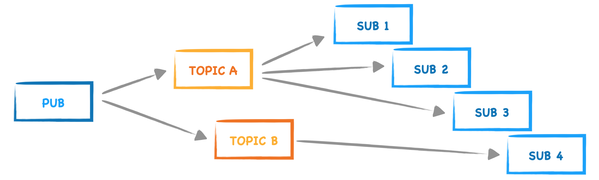

Benchmarking for ZeroMQ library
=========

Questo repository tratta la valutazione di [ZeroMQ](https://zeromq.org/) 
come libreria di messaggistica rispetto a [ROS2](https://www.ros.org).  

L'obiettivo del progetto è di confrontare le due librerie per stabilire quale soluzione sia quella con minor latenza durante l'invio/ricezione di messaggi.

## Introduzione
### ZeroMQ
ZeroMQ è una libreria di messaggistica asincrona ad alte prestazioni, leggera e semplice da usare. Offre numerosi pattern di messaggistica e diverse modalità di trasporto, ma il suo punto di forza è la possibilità di essere eseguita senza un broker di messaggi dedicato.  
 

### ROS2
Il Robot Operating System (ROS) è un insieme di tools e librerie open source che permettono di creare applicazioni anche molto complesse in ambito robotico. 
ROS consente di mettere in comunicazioni una rete di nodi (processi) con un hub centrale in modo semplice e tramite diversi livelli di affidabilità. Vengono fornite funzionalità per astrarre l’hardware, i driver dei dispositivi, la comunicazione tra processi su più macchine, gli strumenti per il test e la visualizzazione e molto altro ancora.

## Pattern Publisher - Subscriber (PUB-SUB)
ZeroMq mette a disposizione numerosi pattern di comunicazione ma in quanto ROS2 preferisce l'utilizzo del pattern Publisher-Subscriber, si è deciso di utilizzare quest'utltimo per l'esecuzione dell'esperimento.

Nel pattern PUB-SUB i nodi si scambiano direttamente dei messaggi.
Il nodo che fa da publisher, non conosce l'identità dei destinatari, si limita a pubblicare il suo messaggio all'interno di un preciso topic al quale si iscriveranno tutti i nodi subscriber che vorranno recepire quelle informazioni. 
E' possibile quindi che ci siano più nodi che pubblicano i messaggi sempre con il vincolo che solo loro potranno inviare messaggi ai vari topic: si ha una comunicazione N-to-N unidirezionale.

## Set up
